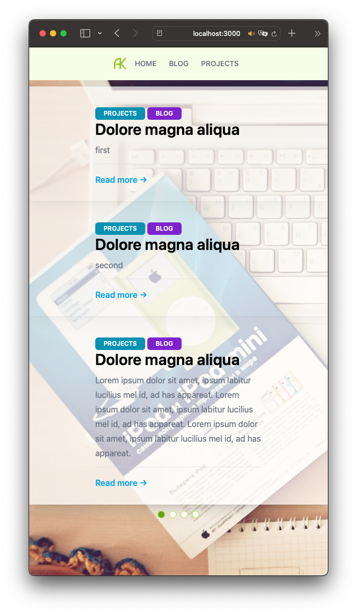

# Problems

I am since a few days to implement a [design](DESIGN.md) that I have created years ago with reactJS and tailwindCSS and bump there to my limits.

* Home Banner:
* Boxes areas on smartphone absolutely terrible. How do I get them designed so that they can rotate through?
* On desktop I would like to have these boxes all in the same size. In the design is a button in the code simply text there I do not know quite what would fit designmäsig. The text should not enlarge the area in this box. How do I make sure?

To the [HomePage.jsx](src/pages/HomePage.jsx) file.

* How do I get this divider on the blog with the line that should have a maximum size?

To the [BlogPage.jsx](src/pages/BlogPage.jsx) file.

* On the project page in the right area I want to make a listing of projects. However, I do not know how I can make this kind of listings. Here I need help. Am also open to other ideas of listing.
* What else can I optimize the tailwindCSS?

## The react part

* In folder components should be parts of the design. Here I am unsure of the naming and how could I split more of the remaining code.
* With the pages folder I am actually satisfied.
* What are the possibilities to integrate data dynamically?
* I would like to build in https://webauthn.io so that I can then blog posts and projects. But I have no idea about it and wonder if it would be safe enough if I would use this https://github.com/MasterKale/SimpleWebAuthn for it (is linked on the webauthn page).
* Save blog posts to the MySQL database or just save an .md file to the server and retrieve it? How can I then process that in reactjs? What makes sense here?
* How I want to integrate projects I haven't thought about yet.
* add i18n support for multi language support.

## Backend

I have already touched on some of this above. Here I want to tell you that I have a web hoster that allows me to run nodejs projects. MySQL server also available.

* As I just saw webauthn needs a server part.
* What kind of ORM makes sense for my project?

## Design

If you have any suggestions for changes, please let me know. Join my [Discord](https://discord.gg/ZFz6YkRR4y)

Translated with [DeepL](https://www.DeepL.com/Translator) (free version)